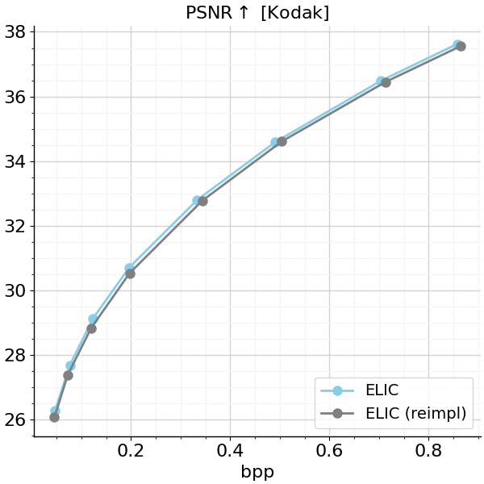

# ELIC (TensorFlow 2)

This repository provides a TensorFlow implementation of ELIC based on:

- [ELIC: Efficient Learned Image Compression with Unevenly Grouped Space-Channel Contextual Adaptive Coding (CVPR 2022)](https://arxiv.org/pdf/2203.10886.pdf),
- [Channel-wise Autoregressive Entropy Models For Learned Image Compression (ICIP 2020)](https://arxiv.org/pdf/2007.08739.pdf).

    

<em>Image source: https://arxiv.org/pdf/2203.10886.pdf</em>

## Updates

***10/01/2023***

1. Initial release of this project

## Acknowledgment
This project is based on:

- [TensorFlow Compression (TFC)](https://github.com/tensorflow/compression), a TF library dedicated to data compression.
- [VCT](https://github.com/google-research/google-research/tree/master/vct), a video compression transformer provided by Google Research. We use their ELIC synthesis + analysis transforms.

## Pretrained Models/ Performance

We initially trained all models on the whole ImageNet dataset (not the largest 8000 image subset) using the same configuration described in [Section 6.1](https://arxiv.org/pdf/2203.10886.pdf). In contrast to He et al., we also omitted noising-downsampling preprocessing out of convenience.

To account for the differences and to somewhat better adapt to high-resolution images, we additionally fine-tuned all models on the CLIC 2020 training set for 450k iterations (lr=1e-4 for the first 400k steps, lr=1e-5 for the last 50k). Further hyper-parameter tuning might provide better results.

    

Pre-trained models can be downloaded [here](https://drive.google.com/drive/folders/1MR08jdXcLH0YYxuLMsomSN3xT9voHJFn?usp=sharing).

## File Structure

     res
         ├── doc/                                       # addtional resources
         ├── eval/                                      # sample images + reconstructions
         ├── train_hypmqw2022/                          # model checkpoints + tf.summaries
         ├── hypmqw2022/                                # saved model
     checkerboard_helper.py                             # checkerboard helpers (He et al., CVPR 2021)
     elic_transforms.py                                 # ELIC analysis & synthesis transforms based on VCT 
     hypmqw2022.py                                      # core of this repo

## License
[Apache License 2.0](LICENSE)
